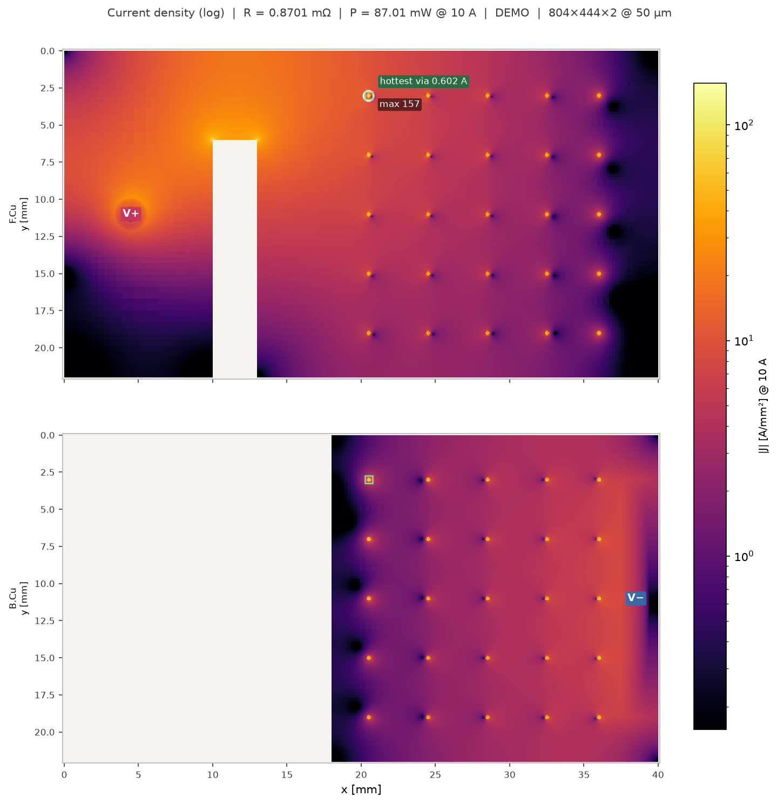
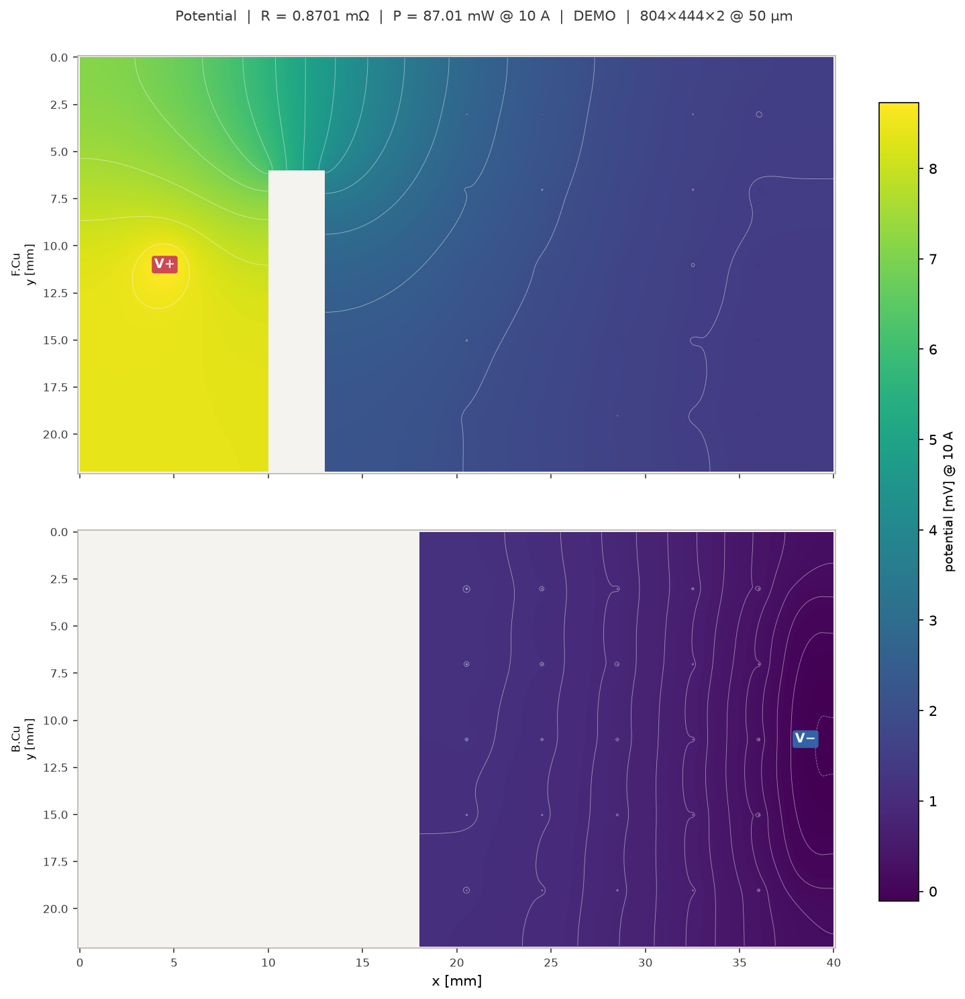
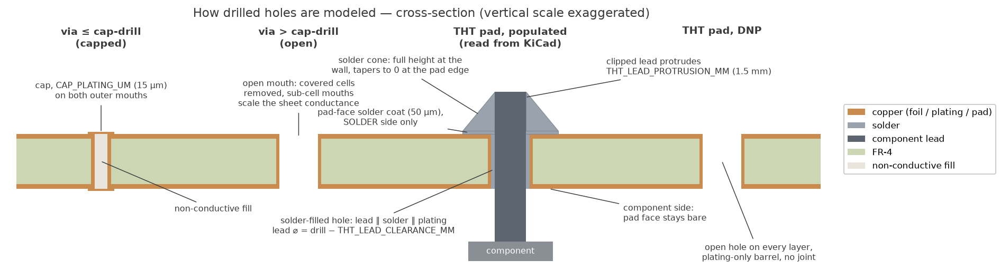
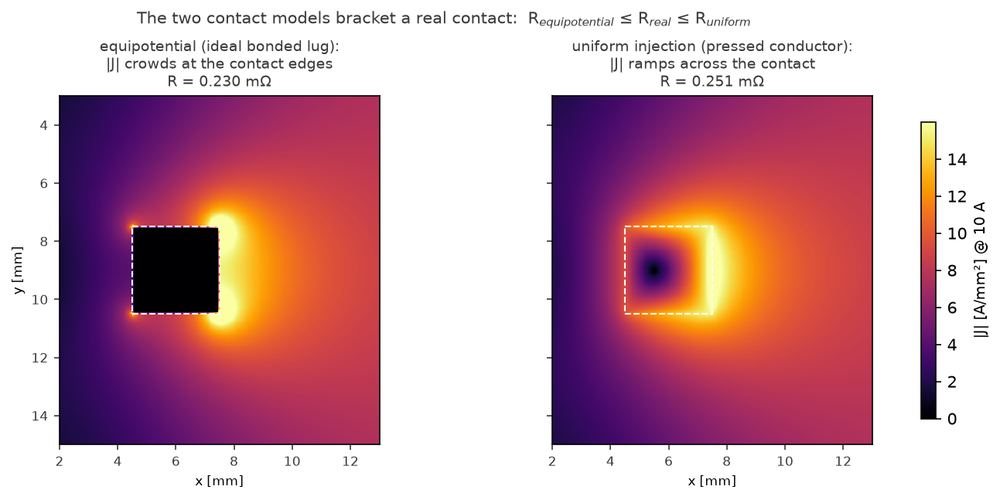
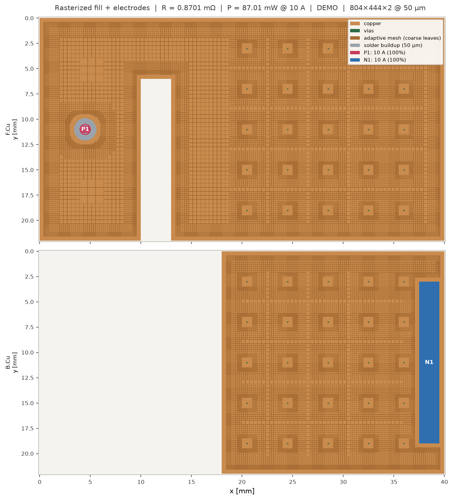

# Fill Resistance — KiCad 10 plugin

Computes the **DC resistance of copper zone fills and traces**
between two contacts, **single- or multi-layer**: the chosen net's fills
(teardrops included) and tracks on the selected copper layers are
solved as coupled finite-difference sheets linked by the net's **via
and through-hole-pad barrels** (18 µm plating, configurable). Shows
per-layer rasterized maps, potential, current density, and **power
density**, and reports **per-via currents** (via ampacity!) and total
dissipation at a **selectable test current**. PNGs + a text summary are
saved per run. An optional **skin-effect correction** (exact 1D
foil/barrel solution at a user-set frequency) estimates the resistive
skin rise only — it is **not** an AC impedance simulation (no proximity
effect, no inductance; see *Model & limits*).


*Real output on a synthetic two-layer net: current from a soldered
THT-pad contact (V+, injected at the drill-wall ring) squeezes past a
notch in the F.Cu pour, transfers through the stitching-via field into
the B.Cu pour and leaves at the V− lug. Per-via currents and the
hottest via are reported.*


*The matching potential map with equipotential contour lines: they
bunch where the field is strongest — nearly the whole 8.7 mV drop
happens around the notch on F.Cu.*

Uses the KiCad **IPC API** (`kicad-python` / `kipy`), not the deprecated
SWIG API. Requires KiCad **10.0.1+**.

## Platform support

[](https://git.b4l.co.th/B4L/kicad-zone-resistance/actions)

| Platform                    | Status | Verified by |
|-----------------------------|:------:|-------------|
| Windows                     |   ✅   | development platform, full suite before every release |
| macOS                       |   ✅   | field-tested in KiCad 10 |
| NixOS                       |   ✅   | field-tested in KiCad 10 ([setup](docs/NIXOS.md)) |
| Debian 12                   |   ✅   | CI test suite in container |
| Ubuntu 24.04                |   ✅   | CI test suite in container |
| Fedora (latest)             |   ✅   | CI test suite in container |
| Arch (latest)               |   ✅   | CI test suite in container |

CI (`.gitea/workflows/ci.yml`) runs the full pytest suite — solver,
rasterizer, and the platform-fallback regressions — headless against
the real pip wheels of each Linux row, including the
`PySide6.QtWidgets` import probe that decides the matplotlib backend.
What CI *cannot* do is launch KiCad itself, so "runs inside KiCad"
remains field-tested (Windows continuously, macOS and NixOS per
release).

## Setup (one-time)

The plugin is developed and tested on **Windows**; **macOS works**
(field-tested on KiCad 10 after a round of mac-specific fixes), and
**Linux works** (field-tested on NixOS — the hardest Linux to run pip
wheels on; mainstream FHS distributions should be no harder, reports
welcome). KiCad builds the plugin a private Python venv from
`requirements.txt` on every platform, from pre-built wheels only, no
compiler needed. Steps 1–4 are the same everywhere; OS specifics are
spelled out per step and in *Platform notes* below.

1. **Enable the API server**: KiCad → Preferences → Plugins → check
   *Enable KiCad API*.
2. **Check the interpreter path** on the same page (after a 9→10
   upgrade it can still point at KiCad 9):
   - **Windows**: KiCad's own Python,
     `C:\Program Files\KiCad\10.0\bin\pythonw.exe`;
   - **macOS**: the Python bundled inside the app,
     `/Applications/KiCad/KiCad.app/Contents/Frameworks/Python.framework/Versions/Current/bin/python3`;
   - **Linux**: the first `python3` on `PATH` — needs Python ≥ 3.9
     with the `venv` module (Debian/Ubuntu:
     `sudo apt install python3-venv`).
3. **Deploy** (dev checkout; end users install the PCM zip instead, see
   *Packaging / publishing*). Windows:
   ```powershell
   powershell -ExecutionPolicy Bypass -File deploy.ps1        # junction (dev)
   powershell -ExecutionPolicy Bypass -File deploy.ps1 -Mode Copy
   ```
   Linux / macOS (also works on Windows with developer mode):
   ```bash
   python3 tools/deploy.py            # symlink (dev)
   python3 tools/deploy.py --copy
   ```
   Plugin directory: `Documents/KiCad/10.0/plugins` on Windows and
   macOS, `~/.local/share/kicad/10.0/plugins` on Linux.
4. **Restart KiCad**; first load builds the plugin venv (numpy, scipy,
   matplotlib, PySide6 — takes minutes; the Ω button appears when done).
   If stuck: in the PCB editor, Preferences → *PCB Editor → Action
   Plugins*, **right-click** the plugin's row → *Recreate Plugin
   Environment* (context menu only — there is no button). Manual
   equivalent: delete the plugin's venv and restart KiCad —
   - Windows: `%LOCALAPPDATA%\kicad\10.0\python-environments\th.co.b4l.fill-resistance`
   - macOS: `~/Library/Caches/kicad/10.0/python-environments/th.co.b4l.fill-resistance`
   - Linux: `~/.cache/kicad/10.0/python-environments/th.co.b4l.fill-resistance`

### Platform notes

- **Windows** is the development and test platform — everything in
  this README was exercised here. KiCad's bundled Python is 3.13, so
  the venv gets the current dependency stack.
- **macOS** — **works** (field-tested on KiCad 10). Requires
  macOS 12+ (KiCad's own minimum; Intel and Apple Silicon — the dmg
  is universal). KiCad's bundled Python is **3.9**, so pip resolves
  an older stack (numpy 2.0, scipy 1.13, matplotlib 3.9,
  PySide6 6.9/6.10); the plugin code is kept 3.9-compatible (guarded
  by a test) and the suite is also run against that older stack.
  Plot and dialog windows may open **behind** the KiCad window (they
  are raised best-effort) — check the Dock if nothing seems to appear
  after a solve.
- **Linux** — **works** (field-tested on NixOS, KiCad 10; mainstream
  distributions are audited but not yet field-tested). The venv uses
  the system Python (3.9+), so the stack matches your distribution.
  On **ARM64 (aarch64)** there are no pyamg wheels —
  `requirements.txt` skips pyamg there and the solver falls back to
  Jacobi-CG: same results, noticeably slower on large grids.
  **NixOS**: **works** (field-tested on NixOS 26.05, Plasma 6). pip's
  Linux wheels link against standard FHS library paths, which NixOS
  does not provide — PySide6 fails with `libgthread-2.0.so.0: cannot
  open shared object file`. The plugin cannot fix this from inside
  its venv (KiCad installs wheels only); run KiCad inside an FHS
  environment built with `buildFHSEnv`, and — on KDE Plasma — unset
  `QT_PLUGIN_PATH`, which otherwise poisons the wheel's bundled Qt
  with the system's Qt plugins. The tested wrapper (exact package
  list incl. the non-obvious `zstd.out` and xcb-util family), a
  `steam-run` quick test, and a debugging guide are in
  [docs/NIXOS.md](docs/NIXOS.md).

## Usage

1. Mark the current-injection terminals. Each terminal may have
   **multiple parts** (all merged into one externally bonded contact):
   - **V+ rectangles on `User.1`**, **V− rectangles on `User.2`**
     (marker layers, configurable via `ELECTRODE_POS_LAYER` /
     `ELECTRODE_NEG_LAYER`), any number per side, axis-aligned;
   - **pads and vias** (SMD pad: real copper shape on its own layer;
     through-hole pads and vias become **barrel contacts**: the current
     enters at the drill wall on every spanned layer, see below).
     Selected pads/vias fill the side that has **no rectangles**, so
     mixing both kinds is the everyday workflow: e.g. select **one
     rectangle on `User.1`** (V+) **plus any number of pads / THT
     holes** (Ctrl-click) — the pads together form the V− terminal
     (a connector's pin group, a via cluster, …). All selected
     pads/vias go to that one side; if both marker layers already
     provide rectangles, selecting pads on top is an error;
   - legacy: exactly 2 selected contacts with no marker rectangles still
     works; empty selection scans the whole board's marker layers.
2. **Select the contacts**, click the **Fill Resistance** Ω button.
3. In the **dialog**, pick the net (defaults to the selected pad's net),
   check the **layers** to include, set each contact's layer scope
   ("All selected layers" = bolted-lug/through contact), the **test
   current**, and optionally a grid cell size. Multiple layers are coupled
   through the net's via/pad barrels automatically.
4. Wait for the solve. Depending on board size, included layers, cell
   size and your hardware it can take **considerable time** — large
   multi-layer pours at fine cell sizes may run for minutes (on our
   test setup a typical real-board run finishes in ≈ 8 s). Then read
   R / voltage drop / total power in the figure titles and status
   bar. Outputs land in `<board dir>/fill_res_results/<timestamp>/`
   (if the board directory is not writable — e.g. a demo project opened
   straight from the mounted installer image — a temp directory is used
   instead and its path printed to the Messages panel):
   per-layer `1_raster_map` / `2_potential` / `3_current_density` /
   `4_power_density` PNGs, `summary.txt` (incl. the busiest vias with
   per-via current and dissipation, and the **current through each
   injection area** — computed flux with the equipotential model,
   prescribed area share with the uniform model), `geometry_dump.json`.
5. **Experimental — overlays inside KiCad** (dialog checkbox, default
   off; KiCad ≥ 10.0.1): after the solve, the per-layer **|J| heatmaps
   are pushed into the open board** as unlocked reference images on
   `User.9`…`User.12` (`OVERLAY_LAYERS`; enable them in Board Setup),
   copper layers mapped in stackup order, top first. Toggle them in the
   Appearance panel like any layer; opaque over copper, transparent
   elsewhere, cold end lifted so it stays visible on the dark canvas.
   Reference images never plot to gerbers. Every push **replaces all
   reference images on those layers**, so don't store unrelated images
   there. Also available headless:
   `python tools/kicad_heatmap_overlay.py --net X --amps 10`.
6. **Experimental — low-current copper marking** (dialog checkbox,
   default off): after the solve, the copper whose |J| is **below a
   threshold** is outlined as **filled graphic polygons** on user
   layers. The threshold is dialog-settable in one of two units
   (selector next to the field): **relative** — % of the mean |J| over
   all solved copper (default, 10 %) — or **absolute** in **A/mm²**;
   since |J| scales with the test current, the absolute variant is
   meant to be used with the real operating current entered as test
   current. Polygons land on
   `User.5`…`User.8` (`TRIM_LAYERS` in `fill_resistance/config.py`;
   enable them in Board Setup), copper layers mapped in stackup order,
   top first. Marked specks under `TRIM_MIN_AREA_MM2` (0.5 mm²) are
   dropped. Each region is one selectable polygon — use KiCad's
   **Edit → Convert** to turn one into a rule area or zone cutout by
   hand. Per-layer areas are printed to the Messages panel and the
   polygons also land in `low_current_copper.json` next to the PNGs.
   Every push **replaces all graphic polygons on those layers** (one
   undo step). **This is a suggestion, not a safe cut list**: copper
   carries little current *because* the rest carries it — removing
   copper redistributes the current and raises |J| everywhere else, so
   re-run after any change. The pour may also serve thermal spreading,
   EMI return paths, or plane capacitance, which this DC analysis does
   not see.

## Model & limits

- Sheet model per layer: R□ = ρ/t, ρ = 1.68e-8 Ωm (20 °C), t from the
  board's physical stackup. Layer z-positions from the stackup drive the
  barrel lengths.
- Via/pad barrels: thin-wall annulus, R = ρ·L/(π·d·t_plating),
  `VIA_PLATING_UM = 18` in `fill_resistance/config.py`. Vias are always
  plated. Each via also contributes its **ring/pad copper** (a
  full-thickness disc of the pad diameter on every spanned layer) and
  its **drill mouth**, area-weighted per cell: with the **"vias filled +
  capped" checkbox** (default on, `VIAS_CAPPED`) the mouth carries a
  thin copper cap (`CAP_PLATING_UM = 15`, fab spec) on the **outer**
  layers and is an open hole on inner layers; unchecked, mouths are open
  holes everywhere. The fab caps only small vias: drills above the
  dialog's **"capped up to drill"** threshold (default
  `CAP_MAX_DRILL_MM = 0.5`) keep open mouths even with capping
  selected. Layer-to-layer the cap never matters at DC (it is in
  parallel with the annular-ring contact, not in series), so the checkbox
  only affects in-plane conduction across outer-layer mouths. Sub-cell
  mouths scale their cells' sheet conductance by the true covered
  fraction (4×4 supersampling), so coarse grids see the correct small
  perturbation instead of a whole-cell hole. Barrels are gathered in
  **single-layer runs too** (drill mouths perforate a lone plane).
  **THT pads are fully modeled**: their exact copper shapes (incl.
  oblong pads, fetched from KiCad; the outer shape stands in for inner
  rings) are stamped onto every included layer, and every **populated**
  pad carries its full **soldered joint** on its SOLDER side (opposite
  the component; the component-side pad face stays bare). The hole
  holds the **component lead** (a cylinder of drill −
  `THT_LEAD_CLEARANCE_MM`, resistivity `THT_LEAD_RHO_OHM_M`, copper by
  default; raise it for brass/steel leads) **plus solder** in the
  remaining annulus, both in parallel with the plating. The filled
  hole also conducts **in-plane on every spanned layer** (component
  side and inner layers included): the mouth keeps its copper and
  additionally carries the plug — lead disc plus solder bore — as
  conduction-equivalent copper of the **full hole depth** (the pin
  continues beyond both mouths, so each layer sees the whole plug
  cross-section). The joint is side-symmetric except for the solder:
  coat and cone on the solder side only. On the raster map these
  mouths render in a darker tin color. The pad face
  gets the average-thickness solder coat (exact pad shape) and the
  protruding-lead cone (see barrel contacts below; on oblong pads the
  cone tapers to the pad's short dimension). **Slotted (oval) holes**
  keep their true stadium shape: the barrel wall, drill mouth, contact
  ring and lead cone all follow the slot (rotated with the pad), and
  the barrel conducts over the slot's real perimeter/bore area — not a
  circle of the slot's long dimension. Whether a hole is a via or
  a THT pad, the owning footprint's side, and its **Do not populate**
  flag are all read from KiCad. **DNP pads** get an **open hole** and
  a plating-only barrel, no joint. At f > 0 the thickness scaling is
  applied multiplicatively to the skin-corrected sheet conductance
  (approximation). Per layer a barrel attaches to
  the fill cell under it, or to the nearest copper cell within the pad
  footprint plus one grid cell — fills joined by **thermal-relief
  spokes** still connect; wider antipads do not, and the barrel bridges
  the layers above/below with the full barrel length. Barrels that reach
  fill on fewer than two layers carry no current and are reported.

  
  *The four hole types: capped small via, open large via, populated THT
  pad with its full solder joint (lead ∥ solder ∥ plating in the hole,
  one-sided pad coat, protruding-lead solder cone), and a DNP THT pad.*

- The net's **traces** (straight and arc tracks, exact outline polygons
  incl. rounded ends) conduct together with the fills — dialog checkbox,
  on by default (`INCLUDE_TRACKS`). Traces narrower than
  `TRACK_1D_FACTOR` (3) grid cells are modeled as exact **1D resistor
  chains** along their centerline — true arc length per link, so their
  series resistance carries no discretization error and no cell-size
  tuning is needed for thin traces. 1D-modeled traces show potential,
  power density, and |J| (the true in-trace density from the link
  currents, |ΔV|/(ρ·Δl)). Pad copper is part of the conductor: THT pad
  shapes are stamped on every included layer (see above), **SMD** pad
  shapes on their own layer (`INCLUDE_SMD_PADS`) — pads are the
  junctions where traces and thermal-relief spokes actually meet, so
  without them a multi-track junction necks down to the accidental
  overlap of the track ends. Dead-end pads (component terminals) are
  dropped with the other copper not connected to both contacts.
- **Solder buildup on mask openings** (dialog checkbox, **off by
  default**; `INCLUDE_MASK_BUILDUP`): zones drawn on `F.Mask`/`B.Mask`
  are treated as mask openings that collect `SOLDER_THICKNESS_UM`
  (50 µm) of solder on the exposed pour, plus an optional user-defined
  added copper thickness (dialog field, e.g. a soldered busbar/wire).
  The sheet conductance there becomes t_Cu/ρ_Cu + t_solder/ρ_solder +
  t_extra/ρ_Cu (SAC305 ρ = 1.32e-7 Ωm: 50 µm solder ≈ 6.4 µm copper);
  interface faces use harmonic-mean conductances. Buildup areas render
  tin-gray on the raster map; |J| in them is referenced to the
  conductance-equivalent copper thickness.
- **Barrel contacts**: a selected **via or through-hole pad** injects at
  the **drill-wall ring** on every layer the barrel spans — the current
  physically enters through the lead/wire soldered into the hole, so
  the spreading resistance across the pad and surrounding pour is part
  of the result (both contact models; verified against
  R = ρ/(π·t)·acosh(d/2a) for two circular contacts on a sheet).
  Slotted holes inject along the stadium-shaped slot wall. A
  soldered **THT joint** additionally assumes the **hole is filled with
  solder** (core in parallel with the plating) and the **pad face on
  the solder side carries an average-thickness solder coat**
  (`SOLDER_THICKNESS_UM`, 50 µm) over the modeled copper under the pad
  shape — the solder side is the side opposite the component (taken
  from the owning footprint; assumed `B.Cu` if it cannot be found),
  and the component-side pad face stays bare. There the **clipped
  lead protrudes** `THT_LEAD_PROTRUSION_MM` (1.5 mm, 0 = off)
  and a **solder cone** wraps
  it: full protrusion height at the drill wall, tapering linearly to
  zero at the pad edge, applied as extra conduction-equivalent copper
  per cell. The tall solder column at the wall pulls the joint
  vicinity to lead potential — equivalent to extending the barrel wall
  vertically — while the taper carries the radial spreading. To model
  a probe pressed onto the pad face instead, draw a marker rectangle
  over the pad.
- **Contact models** (dialog / `CONTACT_MODEL`): default **uniform
  injection** — a conductor pressed on top feeds the current orthogonally
  with uniform surface density, so |J| ramps across the contact area
  (R = ΔV̄/I from area-averaged terminal potentials); or
  **equipotential** — ideal bonded lug (Dirichlet). The two bracket a
  real contact: R_equipotential ≤ R_real ≤ R_uniform. If the selected
  fills form several disconnected copper groups that each touch both
  terminals (e.g. planes joined only through the bolted lugs), only the
  equipotential model is well-defined; the uniform model stops with an
  error instead of prescribing an arbitrary split.

  
  *|J| around the same 3×3 mm contact under both models: the ideal
  bonded lug crowds the current at the contact edges (no in-sheet
  current inside an equipotential region), the pressed conductor ramps
  it across the contact area.*
- Fields are reported at the dialog's test current; power scales with I².
- **Skin effect (f > 0)**: per-layer effective sheet resistance from the
  exact 1D foil-diffusion solution `Zs = τρ·coth(τt)`, `τ = (1+j)/δ`
  (`SKIN_SIDES = 1` in config: plane facing a return plane; `2` =
  isolated foil), and the analogous correction for the 18 µm barrel wall.
  Enter one frequency per run (e.g. a switching harmonic, with its RMS
  amplitude as the test current); suffixes `k`/`M` are accepted.
  **Caveat:** this is **not an AC impedance simulation** — skin
  resistance is only a small part of real AC behavior. Only
  through-thickness crowding is modeled: lateral (proximity-effect)
  redistribution needs a magneto-quasistatic solver and is not
  captured — since the resistance-driven distribution is the
  minimum-dissipation one, the f > 0 resistance is a rigorous **lower
  bound** — and inductance, usually the dominant term of a real AC
  impedance, is absent entirely.
  Rule of thumb for 70 µm foil: skin is negligible below ~300 kHz
  (δ = 173 µm at 142 kHz), ~+11 % at 1 MHz. At f > 0 the |J| maps are
  referenced to the skin-reduced conduction-equivalent thickness
  t/(R_AC/R_DC) — the density in the copper that actually conducts —
  not the geometric foil thickness.
- 5-point FDM per layer on an auto-sized shared grid (~2 M fine cells
  with the uniform grid; ~8 M with the adaptive grid, whose unknown
  count no longer scales with the fine-cell count). Direct sparse solve
  up to 500 k unknowns, AMG-preconditioned CG (pyamg) above (Jacobi-CG
  if pyamg is missing). Discretization error typically ≲ 2 % at
  defaults; halve the cell size and compare to judge convergence.
- **Adaptive cells** (dialog checkbox, **on by default**;
  `ADAPTIVE_CELLS`):
  solves on a 2:1-balanced quadtree — fine cells at copper boundaries,
  electrodes, traces, via mouths and buildup, blocks up to
  `ADAPTIVE_MAX_CELL_UM` (1 mm) in plane interiors (`ADAPTIVE_GUARD`
  sets the clearance a block needs to grow). The **minimum element size
  is the grid cell size itself** (auto / dialog / `CELL_UM_OVERRIDE`);
  the uniform limit reproduces the normal grid exactly. Large
  speed/memory wins on big pours. The raw coarse–fine interface flux
  bias (~0.5–2 % low) is removed by a **deferred-correction pass**
  (`ADAPTIVE_CORRECTION_PASSES`, default 1: reconstruct leaf gradients,
  move the tangential term to the RHS, re-solve on the reused
  factorization/AMG hierarchy) — measured residual deviation from the
  uniform grid ≲ 0.03 %, with the power-balance identity intact. All
  fields are expanded back to the fine grid for the maps and reports.

  
  *The raster map of the demo net: quadtree leaves drawn on the copper
  (fine at boundaries, electrodes, via mouths and pads; coarse blocks
  in plane interiors), the tin-gray solder coat of the THT-pad contact
  P1, and the via field with its pad copper.*

**Measured vs. computed**: we tested the plugin on a few real boards
against a UT3513+ micro-ohm meter; the measured resistances were within
±20 % of the computed values. We attribute the deviation to
imperfections of the testing setup (probe placement and probe contact
resistance vs. the ideal modeled contacts) and to manufacturing
inaccuracies — actual copper and plating thicknesses routinely deviate
from nominal. Relative comparisons between layout variants are
accordingly more trustworthy than absolute numbers.

## Offline / development

Every run writes `geometry_dump.json`; re-solve without KiCad:

```sh
uv run python -m fill_resistance.standalone dump.json
    [--current 40] [--cell-um 50] [--layers F.Cu,In1.Cu] [--no-show]
    [--out DIR] [--force-iterative]
```

Dev environment, tests, headless extraction — [uv](https://docs.astral.sh/uv/)
manages the venv from `pyproject.toml`/`uv.lock` (`requirements.txt`
stays: KiCad builds the plugin's runtime venv from it):

```sh
uv sync                                              # one-time env setup
uv run pytest -q                                     # incl. exact analytic cases
uv run python tools/api_probe.py                     # IPC API probe vs live KiCad
uv run python -m fill_resistance.board_io dump.json [NET]  # extract only
```

## Packaging / publishing

`python tools/build_package.py` builds the PCM addon zip in `dist/`
(installable right away via Plugin and Content Manager → *Install from
File*) plus `dist/metadata-registry.json` with the SHA-256 and sizes
filled in. To publish: upload the zip to a release, set `download_url`
(and the `homepage` resource in `metadata.json`), then submit the
registry copy as `packages/th.co.b4l.fill-resistance/metadata.json` in a
merge request to <https://gitlab.com/kicad/addons/metadata>. Icons are
regenerated with `python tools/gen_icons.py`; the README figures in
`docs/img/` with `uv run python tools/gen_readme_figs.py`
(real solver output on small synthetic boards, plus the hand-drawn
hole cross-section).

## License

GPL-3.0-or-later — see [LICENSE](LICENSE).

## Troubleshooting

- **No toolbar button**: venv still building (wait), or build failed →
  *Recreate Plugin Environment* (right-click the plugin's row in
  Preferences → *PCB Editor → Action Plugins*); check the interpreter
  path (setup 2); on Linux make sure `python3-venv` is installed. Last
  resort: delete the venv directory by hand (setup 4) and restart.
- **"Could not connect to KiCad's IPC API"**: API server not enabled, or
  KiCad not running (no headless mode in KiCad 10).
- **"KiCad is busy"**: a modal dialog is open in KiCad — close it, rerun.
- **Windows don't appear**: they may open behind KiCad (raised
  best-effort); PNGs are always saved regardless.
- **Result seems too low/high**: remember the model is fills + barrels
  only, with ideal contacts; measure electrode-to-electrode.

## LLM disclaimer

This plugin was developed with an LLM: Anthropic's **Claude** (Claude
Code, model Claude Fable 5). The physics model, solver, tests, tooling
and this documentation (including the figures; all but the hand-drawn
hole cross-section are generated by the solver itself) were written by
the model, feature by feature, under human direction and review
(janik / B4L); most commits carry a `Co-Authored-By: Claude` trailer.

What keeps this honest: the test suite pins the numerics to exact
analytic references (strip and annulus resistances, the acosh spreading
resistance of two circular contacts, skin-effect limits, power-balance
identities) and to convergence/regression checks; run it with
`uv run pytest`. Real boards were measured against a UT3513+ micro-ohm
meter (see *Measured vs. computed* above). Nevertheless, an LLM wrote
this: read *Model & limits*
critically, treat surprising numbers with the usual engineering
suspicion, and cross-check against a hand estimate before trusting a
result with hardware. Bug reports are very welcome.
